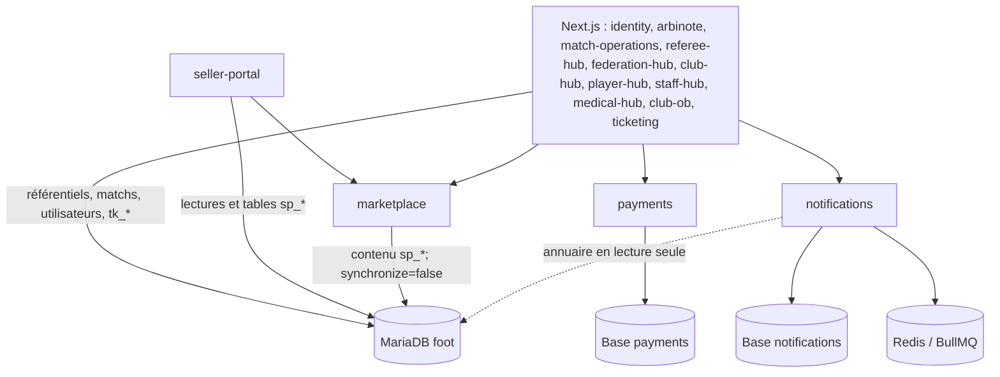

# foot

Plateforme de gestion d'une ligue de football (fédérations, ligues, clubs, matchs, arbitrage) organisée en plusieurs applications indépendantes qui partagent une même base de données MariaDB (`foot`) et un mécanisme d'authentification centralisé (SSO par cookie JWT).

## Applications

Les ports ci-dessous sont ceux des scripts `package.json` (ou la valeur par défaut du serveur lorsque le script ne passe pas de port). Les neuf applications orchestrées par `start.sh` reçoivent explicitement les ports 3000 à 3004, 3007 à 3009 et 3012, indiqués entre parenthèses lorsqu'ils diffèrent.

| Projet | Rôle | Port local | Authentification |
|---|---|---:|---|
| [`identity`](./identity) | Identité centralisée staff/club et membre public, connexion Google comprise ; émet le cookie JWT partagé. | 3000 par défaut (3004 via `start.sh`) | Émetteur SSO ; identifiants ou Google |
| [`arbinote`](./arbinote) | Perception publique des arbitres : profils, matchs, votes, statistiques et classement. Aucun back-office fédéral. | 3000 | Public anonyme/fingerprint ; SSO membre facultatif pour les votes |
| [`match-operations`](./match-operations) | Feuille de match électronique en kiosque : avant-match, live, événements, après-match et signatures. | 3000 par défaut (3001 via `start.sh`) | Aucune session utilisateur ; preuve par signature sur place |
| [`referee-hub`](./referee-hub) | Espace personnel privé des arbitres : désignations, équipe arbitrale, profil et accès à la feuille de match. | 3000 par défaut (3009 via `start.sh`) | `REFEREE`, `MATCH_OFFICIAL` ou `REFEREE_OBSERVER` via SSO et affectation personnelle |
| [`federation-hub`](./federation-hub) | Référentiels, administration de l'arbitrage, évaluations officielles privées et modération ArbiNote. | 3000 par défaut (3002 via `start.sh`) | SSO avec scopes plateforme/fédération/ligue et affectations observateur |
| [`club-hub`](./club-hub) | Gestion d’un club : effectif, staff, discipline, contenus, boutique, sponsors, académie, billetterie admin et réglages. | 3000 par défaut (3003 via `start.sh`) | Rôles club (`ADMIN`, `SOUS-ADMIN`, `COACH`, …) via SSO |
| [`player-hub`](./player-hub) | Espace joueur multi-clubs : calendrier, convocations, entraînements, matchs, statistiques, discipline, déplacements, disponibilité et notifications — en lecture sur les données déjà gérées par `club-hub` (`cms_convocations`, `cms_trainings`, `cms_player_stats`, `Card`/`Suspension`/`Fine`, `cms_trips`...), écriture limitée aux réponses du joueur connecté. | 3007 | `PLAYER` via SSO (scopé à un club ET à un joueur, voir `identity/src/entities/User.ts`) |
| [`staff-hub`](./staff-hub) | Espace staff technique multi-clubs (coach, adjoint, analyste, préparateur...) : effectif, calendrier, entraînements, présences, matchs, convocations, composition, planches tactiques, statistiques et déplacements — mêmes données et même RBAC applicatif que `club-hub` (`cms_roles`/`cms_user_roles`), interface plus opérationnelle et menu réduit au périmètre du rôle connecté. | 3008 | Rôles club (`ADMIN`, `OBSERVATEUR`, …) via SSO — identique à `club-hub` |
| [`medical-hub`](./medical-hub) | Espace médical du club (médecin, kiné) : blessures en cours, joueurs indisponibles, alertes de retour, disponibilités, documents et historique — sur `cms_injuries` (possédée par `club-hub`), accès strictement réservé à la permission `medical.view`/`medical.manage` (RBAC déjà en place côté `club-hub`) ; `player-hub`/`staff-hub` n'exposent qu'un statut simplifié, jamais le diagnostic. | 3009 | Rôles club (`ADMIN`, `OBSERVATEUR`, …) via SSO — identique à `club-hub`, gate par permission `medical.*` |
| [`club-ob`](./club-ob) | Site public **custom** de l'Olympique de Béja et espace membre, consommateur de `notifications`. | 3000 | Public ; `MEMBER` via SSO |
| [`ticketing`](./ticketing) | Vente générique multi-clubs, catégories/règles/quota par match et espace « mes billets » ; paiement via `payments`. | 3000 | Public en consultation ; `MEMBER` via SSO pour acheter et consulter ses billets |
| [`seller-portal`](./seller-portal) | UI vendeur marketplace : catalogue, variantes, stock, commandes, retours, payouts et notifications. | 3006 | Cookie vendeur propre (`SP_JWT_SECRET`), indépendant du SSO |
| [`marketplace`](./marketplace) | API NestJS multi-vendeurs : inscription/connexion vendeur ; catégories club ; produits et variantes ; inventaire ; commandes et sous-commandes vendeur ; retours et payouts ; workflow de modération ; notifications vendeur internes. Les commandes, retours et payouts restent du scaffolding à lecture minimale. | 3011 | JWT vendeur Bearer (`SELLER_JWT_SECRET`) ; clé `x-api-key` (`SERVICE_API_KEYS`) pour `club-hub`, `seller-portal` et autres backends internes |
| [`payments`](./payments) | Paiement mutualisé NestJS : Konnect Network, Paymee et Flouci derrière une interface unique. | 3000 | Clé `x-api-key` de service (`SERVICE_API_KEYS`) |
| [`notifications`](./notifications) | Notifications in-app, email et push, préférences, templates multilingues, BullMQ et idempotence. | 3010 | JWT SSO pour les routes utilisateur ; clé `x-api-key` de service en interne |
| [`db`](./db) | Dump SQL de référence du schéma partagé `foot`. | — | — |

Le dépôt ne contient aucun dossier `skote` : il ne s'agit donc pas d'une application versionnée ici. Le suivi détaillé et les écarts connus se trouvent dans [`avancement.md`](./avancement.md).

## Packages internes

| Package | Statut et consommateurs | Exports / responsabilité |
|---|---|---|
| [`packages/auth-shared`](./packages/auth-shared) | Package privé `auth-shared` v0.1.0. Ce n'est volontairement **pas** un workspace pnpm : les applications clientes (`arbinote`, `match-operations`, `referee-hub`, `federation-hub`, `club-hub`, `club-ob`, `ticketing`, `player-hub`, `staff-hub`, `medical-hub`) l'importent par chemin relatif et conservent leur lockfile et leur dépendance `jose`. | Types `CookieReader`, `CookieWriter`, `SsoTokenPayload` ; `getSsoCookieName`, `verifySsoToken`, `getSsoTokenFromRequest`, `verifySsoTokenWithRevocation`, `buildSsoRedirectUrl` et `clearSsoCookie`. Il centralise issuer `foot-sso`, cookie, secret, validation et révocation du JWT sans dépendre de `next/headers`, donc reste compatible Edge Middleware. |

## Composants partagés non déployables

- [`packages/auth-shared`](./packages/auth-shared) — contrat et helpers de vérification des sessions JWT émises par `identity`, importés par les applications clientes.
- [`db`](./db) — instantané SQL de la base partagée `foot`, inventaire des écarts avec les migrations et règles de propriété des domaines.

## Classification des projets — générique vs custom

La règle de contribution est : **aucun composant générique ne connaît un club particulier**. Identité visuelle et contenu propres à l'Olympique de Béja restent dans `club-ob`; le contexte des applications génériques vient du `teamId` résolu côté serveur.

```text
GENERIC PLATFORM (multi-clubs)
├── Frontends Next.js
│   ├── identity, arbinote, match-operations, referee-hub, federation-hub, club-hub, player-hub, staff-hub, medical-hub
│   ├── seller-portal
│   └── ticketing
├── APIs NestJS
│   ├── payments
│   ├── notifications
│   └── marketplace
├── Package partagé
│   └── packages/auth-shared
└── Données de référence
    └── db

CUSTOM APPLICATIONS
└── club-ob — site vitrine + espace membre de l'Olympique de Béja
```

| Projet | Type | Portée |
|---|---|---|
| `identity`, `federation-hub`, `payments`, `notifications`, `marketplace` | Générique | Services plateforme |
| `club-hub`, `player-hub`, `staff-hub`, `medical-hub`, `referee-hub`, `seller-portal`, `ticketing`, `arbinote`, `match-operations` | Générique | Multi-clubs (le portail vendeur reste en transition vers une API entièrement découplée) |
| `packages/auth-shared`, `db` | Interne partagé | Code d'authentification et schéma de référence |
| `club-ob` | Custom | Olympique de Béja uniquement |

Les éléments de marque génériques doivent venir de `ClubBranding` (`clubId`, `name`, `shortName`, `logo`, `favicon`, couleurs, police et metadata), résolu depuis le `teamId` authentifié et non depuis une valeur arbitraire du frontend.

### Architecture fonctionnelle et intégrations

| Domaine | Responsabilité | Intégrations observées / attendues |
|---|---|---|
| SSO | Identité staff, club et membre ; émission du cookie JWT. | `auth-shared` vérifie ce JWT dans les apps Next.js ; `club-hub`, `federation-hub`, `arbinote`, `club-ob` et `ticketing` appliquent leurs rôles. L'identité vendeur marketplace reste séparée. |
| Paiement | Initialisation et suivi Konnect/Paymee/Flouci. | `ticketing` l'appelle pour l'achat ; `marketplace` figure parmi les clients de service prévus ; un paiement confirmé peut émettre vers `notifications` si configuré. |
| Notifications | In-app/email/push, préférences et distribution asynchrone. | `club-ob` et `club-hub` consomment ses routes ; `payments` peut émettre `PAYMENT_SUCCEEDED`. Les notifications de modération de `marketplace` restent actuellement dans `sp_notifications`, en attente du branchement central. |
| Marketplace | Vendeurs, catégories, catalogue/variantes, stock, modération, commandes, retours et reversements. | `seller-portal` fournit l'UI vendeur et appelle les écritures produit par clé de service ; `club-hub` appelle la modération et les catégories ; données `sp_*` dans `foot`; paiement/notification centralisés sont les intégrations cibles. |
| Billetterie | Catalogue de matchs, règles de vente, réservation, achat et billets d'un membre. | Réutilise les matchs et catégories `tk_*` de `foot`; administration dans `club-hub`; identité `MEMBER` du SSO; paiement via `payments`; `club-ob` redirige son espace billets vers cette app. |
| Applications Next.js | Interfaces publiques, staff, vendeur et custom. | Elles ne réimplémentent pas les domaines NestJS : appels HTTP vers les APIs lorsque branchés, cookie SSO partagé via `auth-shared`, ou session vendeur distincte pour `seller-portal`. |

### Architecture des données actuelle



`marketplace` est déjà présente mais partage encore les tables `sp_*` avec `seller-portal`; elle ne possède donc pas encore une base marketplace autonome. `payments` et `notifications` ont leurs bases dédiées. La séparation du reste de `foot` par domaine est une architecture cible, pas l'état actuel.

### URLs et API Gateway cibles

Aucun domaine DNS/SSL/reverse proxy ci-dessous n'est configuré par ce dépôt.

| Domaine cible | Routage |
|---|---|
| `www.ob.tn` | `club-ob` custom |
| `sso.platform.tn` | `identity` |
| `admin.platform.tn` | `club-hub` multi-clubs |
| `joueur.platform.tn` | `player-hub` multi-clubs |
| `arbitre.platform.tn` | `referee-hub` privé |
| `sellers.platform.tn` | `seller-portal` multi-clubs |
| `tickets.platform.tn` | `ticketing` multi-clubs |
| `federation-hub.platform.tn` | `federation-hub` |
| `scanner.platform.tn` | Contrôle billet, **application absente du dépôt** |
| `api.platform.tn` | Passerelle cible, **absente de l'infrastructure actuelle** |

La passerelle doit garder un domaine unique et router par chemin vers les services réellement présents :

```text
api.platform.tn/payment/*       → payments
api.platform.tn/notifications/* → notifications
api.platform.tn/marketplace/*   → marketplace
api.platform.tn/ticketing/*     → ticketing (routes serveur/API de l'app Next.js)
```

Ce routage est cible : aujourd'hui les trois APIs NestJS sont exposées séparément et `ticketing` est une app Next.js séparée. Le slug club éventuel (`tickets.platform.tn/ob`) doit être résolu côté serveur en `teamId`; il ne constitue ni un déploiement ni une autorisation. De même, `admin.platform.tn` et `sellers.platform.tn` servent tous les clubs, avec contenu et branding déterminés par le contexte authentifié.

## Démarrage local

### Prérequis

- Bash, Docker actif et les images `mariadb:latest` / `phpmyadmin/phpmyadmin` disponibles ;
- `pnpm` et les dépendances déjà installées dans chacun de `identity`, `arbinote`, `match-operations`, `referee-hub`, `federation-hub`, `club-hub`, `player-hub`, `staff-hub` et `medical-hub` ;
- `arbinote/.env.local`, créé depuis `arbinote/.env.example`, avec au minimum `DB_USER`, `DB_PASSWORD` et `DB_ROOT_PASSWORD` : le script s'arrête immédiatement si l'un manque ;
- pour activer le SSO, `identity/.env.local`, créé avec `cp identity/.env.example identity/.env.local` puis complété. Son absence n'arrête pas le script, mais `identity` n'est pas lancé (et aucune autre app ne peut authentifier tant qu'il ne tourne pas — `player-hub`/`staff-hub`/`medical-hub` démarrent quand même, mais toute page renvoie une redirection SSO qui ne peut pas aboutir) ;
- `player-hub/.env.local`, `staff-hub/.env.local` et `medical-hub/.env.local`, créés depuis leur `.env.example` respectif (`DB_*`, `SSO_URL`) : comme pour les autres apps Next.js, le script ne les crée ni ne les valide, il lance quand même le process — sans ce fichier, la connexion base de données échoue à la première requête ;
- les `.env.local` propres aux autres apps Next.js, à créer depuis leurs `.env.example` selon leurs besoins. Le script ne les crée ni ne les valide.

```bash
./start.sh
```

`start.sh` crée ou redémarre `mariadb_container` (MariaDB `foot`, liaison locale `127.0.0.1:3307`) et `phpmyadmin_container` (`127.0.0.1:9090`), attend MariaDB, puis ajoute de façon idempotente `Card.period` si nécessaire. Il lance ensuite en parallèle **exactement** :

| Service | Port injecté par `start.sh` |
|---|---:|
| `arbinote` | 3000 |
| `match-operations` | 3001 |
| `federation-hub` | 3002 |
| `club-hub` | 3003 |
| `identity` (seulement si `identity/.env.local` existe) | 3004 |
| `referee-hub` | 3009 |
| `player-hub` | 3007 (fixé par son propre script `dev`, pas injecté par `start.sh`) |
| `staff-hub` | 3008 (idem) |
| `medical-hub` | 3012 (idem) |

`club-ob`, `ticketing`, `seller-portal`, `marketplace`, `payments` et `notifications` ne sont pas lancés. Démarrez-les depuis leur dossier, après copie de leur `.env.example` vers le fichier demandé par l'application (`.env.local` pour Next.js, `.env` pour les APIs NestJS). Attention : plusieurs scripts Next.js et `payments` utilisent 3000 par défaut ; choisissez `PORT` ou l'option du framework pour éviter une collision. `seller-portal`, `notifications` et `marketplace` fixent respectivement 3006, 3010 et 3011.

## Architecture partagée

- **Authentification** : `identity` émet le cookie `foot_sso_session` (nom configurable), JWT RS256 issuer `foot-sso` (JWKS public, voir `packages/auth-shared`). `packages/auth-shared` centralise sa vérification et sa révocation dans les dix clients (`arbinote`, `match-operations`, `referee-hub`, `federation-hub`, `club-hub`, `club-ob`, `ticketing`, `player-hub`, `staff-hub`, `medical-hub`). `match-operations` conserve un fonctionnement kiosque sans exigence de connexion malgré la disponibilité du helper partagé.
- **Billetterie** : l'identité `MEMBER` est globale ; le `teamId` d'un billet désigne l'organisateur, pas le club favori de l'acheteur. Les catégories et `TicketSaleRule` sont configurées par club dans `club-hub`, puis vendues par `ticketing`.
- **PWA** : `club-hub` et `match-operations` fournissent manifest et service worker ; la synchronisation offline des écritures reste à faire. Le suivi correspondant est dans [`avancement.md`](./avancement.md).
- **État détaillé** : les fonctionnalités et processus encore incomplets, notamment l'unification marketplace et les intégrations inter-services, sont suivis dans [`avancement.md`](./avancement.md), seul document de suivi présent à la racine.

## Points nécessitant une intervention manuelle

Ce qui suit ne peut pas être fait depuis ce repo seul et doit être traité séparément (infra/DNS/secrets) :

- **DNS / SSL / reverse proxy** : aucun des domaines cibles (`www.ob.tn`, `sso.platform.tn`, `admin.platform.tn`, `sellers.platform.tn`, `tickets.platform.tn`, `scanner.platform.tn`, `api.platform.tn`, `federation-hub.platform.tn`) n'existe aujourd'hui — achat/délégation de domaine, certificats et configuration Nginx/Traefik sont à faire hors repo.
- **`SSO_COOKIE_DOMAIN`** : pour un cookie SSO partagé entre plusieurs sous-domaines `*.platform.tn` (`admin.`, `sellers.`, `tickets.`, `scanner.`, `federation-hub.`, …), cette variable (déjà supportée par `identity`, voir son README) doit être positionnée en production sur le domaine parent (`.platform.tn`), avec `HttpOnly`, `Secure` et `SameSite=Lax`. Vérifier aussi le domaine séparé `ob.tn`, hors du périmètre `*.platform.tn`, qui ne peut pas partager ce cookie sans mécanisme dédié (SSO cross-domaine, à concevoir si le besoin apparaît). Ne pas mélanger ce cookie avec celui de `seller-portal` (`SP_JWT_SECRET`, cookie propre) : un vendeur n'est pas un utilisateur `identity`, les deux identités et les deux cookies doivent rester indépendants même une fois tous les sous-domaines déployés sous `.platform.tn`.
- **CORS** : chaque app back-end (`payments`, `notifications`, `marketplace`, `identity`) doit avoir ses origines autorisées mises à jour avec les domaines de production définitifs une fois connus.
- **Callback OAuth (Google)** : `identity` gère la connexion Google — les URIs de redirection autorisées côté Google Cloud Console devront être mises à jour pour `https://sso.platform.tn/...` en production.
- **Secrets/variables d'environnement** : `SSO_JWT_SECRET`, `SP_JWT_SECRET`, `SELLER_JWT_SECRET`, `SERVICE_API_KEYS`, clés des providers de paiement (Konnect/Paymee/Flouci) et clés push (VAPID) doivent être générées/gérées via un secret manager en production — aucune valeur réelle n'est commitée (seuls des `*.env.example` existent), mais leur provisioning reste une action manuelle par environnement.
- **`seller-portal` multi-clubs — backfill en production** : le scoping applicatif est fait (voir `seller-portal/README.md` § « Portée V1 »), mais une installation déjà en production doit exécuter `seller-portal/sql/migration_add_club_id.sql` puis backfiller manuellement `club_id` sur les lignes existantes de `sp_sellers`/`sp_product_categories` avant de compter dessus pour filtrer une requête — nécessite une décision produit sur la stratégie de migration (quel club pour quelles lignes existantes) avant toute exécution en base de production.
- **`ClubBranding` — personnalisation des icônes PWA par club** : nom/couleurs/favicon sont résolus dynamiquement (`federation-hub`, `club-hub`, `seller-portal`), mais les icônes PWA (`icon-192x192.png`, `icon-512x512.png`) restent des assets statiques partagés par tous les clubs — les personnaliser demanderait de valider des images fournies par chaque club (formats/tailles requis pour rester installable), hors périmètre de cette normalisation.
